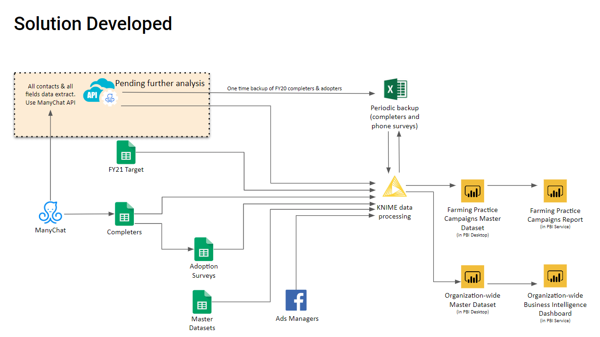
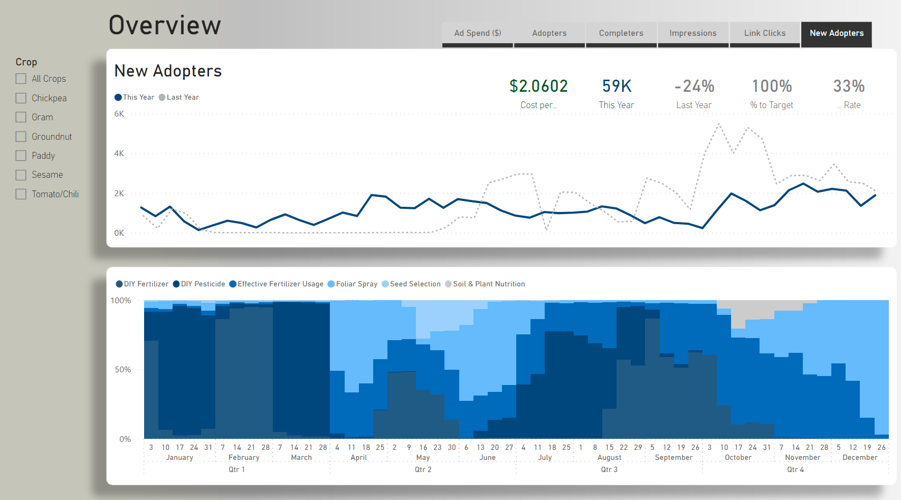
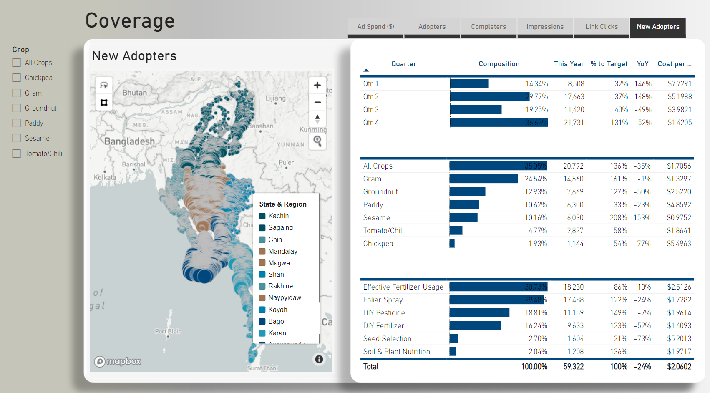

# Background

Amid pandemic and lockdown period, we have come up with an idea to provide timely and cost-effective farming advice directly to farmers’ smartphones via social media. A solution that pivoted to digital campaigns on Facebook and Facebook Messenger to promote lower cost, accessible, and sustainable homemade organic inputs. As a Data Analytics specialist, I led the designing and implementation of an information system with intelligence feedback loops. This python script is part of this system it fetches data from the ManyChat API for subscriber (User) information. This script streamlines the process of retrieving subscriber data from the ManyChat API by leveraging automation and error handling. It ensures the data is stored in a structured format for further analysis or utilization. 

### Fruitful Outcome

To date, this collaborative effort resulted in enhancing the accessibility of sustainable farming practices, weather and market information for 2 million farmers.[(Read More About THIS)](https://bit.ly/3LUldK4)

> As a passionate advocate for mitigating food security risks on a global scale, I strive to be at the forefront of delivering professional services to the agricultural sector and food value chain. Recognizing the significant challenges within the agriculture industry and the fight against food insecurity, I firmly believe that my unique combination of skills makes me well-suited to contribute to this transformative field. 

> To maximize my impact, I am committed to deepening my expertise in critical areas such as problem-solving, information management, data-driven approaches to measuring social impact, remote sensing, geospatial analytics, weather prediction, and precision agriculture technology.

> By continuously expanding my knowledge and skills in these areas, I am confident in my ability to contribute meaningfully to the agricultural transformation and the global effort to combat food insecurity. I am dedicated to utilizing advanced technologies and innovative approaches to drive positive change and create sustainable solutions within the agriculture industry.


# ETL Workflow Diagram



> This script serves the purpose of automating the retrieval of subscriber data from the ManyChat API and saving it in a CSV file (or any desire environment). The code operates in the context of handling a list of subscriber IDs provided in a CSV file, as well as an output CSV file where the fetched data will be stored. To achieve this, the script performs a series of actions. It begins by establishing the necessary API endpoints and authentication headers. It then reads the subscriber IDs from the input CSV file and determines which subscriber IDs have already been processed (already exist) by checking the existing data in the output file.

> The main loop iterates over each subscriber ID, making a GET request to the ManyChat API to retrieve the subscriber's data points. Error handling is implemented to manage exceptions that may arise during the API request. If successful, the response is parsed as a JSON object. The custom fields, name, and gender are extracted from the response and written as rows in the output CSV file. The script keeps track of the progress, printing periodic updates on the percentage of subscribers queried, total execution time, requests per minute, and estimated completion time. Rate limiting is applied to prevent API throttling, with a sleep interval between requests. The script also includes a maximum limit for the number of subscribers to query, allowing for customization.

### Structured Thinking Approach for Feltching Data from ManyChat
Here's a breakdown of what it does:

1. Imports necessary modules (requests, csv, time, pprint, os, datetime, json).
2. Defines the API URL and headers with the authorization token.
3. Sets the file paths for the input (subscriber IDs) and output (datapoints) files.
4. Reads the subscriber IDs from the input file.
5. Checks if any subscriber IDs have already been queried and stored in the output file.
6. Initializes variables for tracking progress and rate limiting.
7. Opens the output file in "append" mode.
8. Sets up a CSV writer object.
9. Iterates over each subscriber ID.
10. Skips the subscriber if it has already been queried.
11. Sends a GET request to the ManyChat API for the subscriber's data.
12. Handles exceptions and errors that may occur during the request.
13. Extracts the custom fields from the response and cleans the values (removes newline characters).
14. Writes the subscriber's name and gender to the output file.
15. Writes each custom variable as a separate row in the output file.
16. Prints progress information at regular intervals.
17. Performs rate limiting to avoid API throttling.
18. Ends the loop if the maximum number of subscribers to query is reached.

### Python Script for Feltching Data from ManyChat

```
import requests
import csv
import time
import pprint
import os
import datetime
import json

# URL paths and API token
url = "https://api.manychat.com/fb/subscriber/getInfo?subscriber_id="
headers = {
    'accept': "application/json",
    'authorization': "insert your key"
}

# File paths for the subscriber ids downloaded from ManyChat and the datapoints coming back from the API calls
# Make sure to change these filepaths to something on your computer
subscriber_ids_fp = "C:\\Users\\DELL\\Downloads\\MC_subscribers_Jun29.csv"

# This can be any filepath. If the file exists, new data will be appended at the end, if it does not exist, it will be created.
datapoints_fp = "C:\\Users\\DELL\\Downloads\\MC_subscribers_Jun29_Datapoints.csv"

# Access the subscribers file
subscriber_ids = []
with open(subscriber_ids_fp, "r") as subscribers_file:
    file_iterator = csv.reader(subscribers_file)
    subscriber_ids = [row[0] for i, row in enumerate(file_iterator) if i != 0]
print("Length of subscribers file: {}".format(len(subscriber_ids)))

# Find the subscriber id's that have already been written to the output file
datapoints_subscriber_ids = []
if os.path.exists(datapoints_fp):
    with open(datapoints_fp, "r", encoding='utf-8') as data_file:
        file_iterator = csv.reader(data_file)
        datapoints_subscriber_ids = [row[0] for i, row in enumerate(file_iterator) if i != 0]
    datapoints_subscriber_ids = set(datapoints_subscriber_ids)
print("Subscribers already queried: {}".format(len(datapoints_subscriber_ids)))
no_subscribers_to_query = len(subscriber_ids) - len(datapoints_subscriber_ids)
print("Subscribers to be queried: {}".format(no_subscribers_to_query))
    
# Initialize the variables
data = {}
subscribers_queried = 1
start_time = time.time()
intermediate_time = start_time
rate_limiter = 0  # 1.0 / 100

# Open the output file once. The with statement makes the file access robust against crashing the code below.
with open(datapoints_fp, "a+", encoding="utf-8", newline="") as data_file:
    # Define the csv writer object. This is probably important for certain text variables that could span multiple lines
    writer = csv.writer(data_file, quoting=csv.QUOTE_ALL)

    # Loop over all the subscriber ids
    for subscriber_id in subscriber_ids:

        if subscriber_id in datapoints_subscriber_ids:
            # Then we have already queried this subscriber_id and collected its datapoints. We skip this subscriber.
            continue

        # The try statement makes sure that the script does not crash when there are errors with the API request
        try:
            # This is the key line of code in this script:
            # For each subscriber id, send a GET request to the ManyChat API to fetch the subscriber's data points.
            # This returns a json object that we can access as a dict.
            response = requests.request("GET", url + subscriber_id, headers=headers, timeout=3)
            response_dict = json.loads(response.text)
            
            if "data" not in response_dict:
                # Error reporting, if there is no data object, we may have received a different response
                raise Exception()
        except Exception as e:
            # Then an error happened with the request. It may help printing some of this information
            print(e)
            print("Exception with request. Printing (previous?) request.")
            print(response_dict)
            print("Current Time =", datetime.datetime.now().strftime("%H:%M:%S"))
            
            # We will wait with continuing the script for a number of seconds / minutes:
            bad_response_pause = 90
            print("Sleeping for {} seconds".format(bad_response_pause))
            time.sleep(bad_response_pause)
            
            # Increasing the rate_limiter lowers the number of requests per second, which reduces the chance of request errors
            rate_limiter += 1.0 / 100
            continue
           
        # The data points are sitting in the ["data"]["custom_fields"] section of the request response
        # The .replace('\n', ' ').replace('\r', ' ') is to remove newline characters from strings. These are in-
        # compatible with the .csv format for PBI. Note that this is only applied if the value is a string.
        # TODO: rewrite list comprehension (because it is not easy to read)
        variables = [
            [
                var["id"], var["name"], var["type"], 
                var["value"].replace('\n', ' ').replace('\r', ' ') if isinstance(var["value"], str)  else var["value"]
            ] for var in response_dict["data"]["custom_fields"]
        ]

        # data[subscriber_id] = variables # Commented out to free up the memory
        
        # Write a row for name and gender
        writer.writerow([subscriber_id, "Name", "Name", "text", response_dict["data"]["name"]])
        writer.writerow([subscriber_id, "Gender", "Gender", "text", response_dict["data"]["gender"]])
        
        # Write each row of custom variables into the output file, with the first value being the subscriber ID
        for var in variables: 
            writer.writerow([subscriber_id,] + var)

        # Track progress every <write_interval> requests
        write_interval = 50
        if subscribers_queried % write_interval == 0:
            print(
                "Subscribers queried: {:.1f}%. Total time: {:.0f} (min). {:.0f} requests per minute. ETA: {:.1f} or {:.1f} (h)".format(
                    100 * (subscribers_queried + len(datapoints_subscriber_ids)) / len(subscriber_ids),
                    (time.time()-start_time)/60,
                    60 / ((time.time()-intermediate_time)/write_interval),
                    ( no_subscribers_to_query - subscribers_queried ) # Number of subscribers to go
                        * ( (time.time()-intermediate_time)/write_interval ) # Time in seconds per request for the last bunch of requests
                        / 3600,
                    ( no_subscribers_to_query - subscribers_queried ) # Number of subscribers to go
                        * ( (time.time()-start_time)/subscribers_queried ) # Time in seconds per request
                        / 3600
                )
            )
            intermediate_time = time.time()
        subscribers_queried += 1
        if subscribers_queried > 1000000:  # max number of subscribers to query
            break
        
        # Avoid ddos blocks or API throttling. Rate limit for post requests is 25 or 10 RPS according to documentation.
        # However, we found that the rate limit is at 10 requests per second.
        time.sleep(rate_limiter)
```

# Where this data goes into ...

This script plays a crucial role in the data ingestion process for this [Dashboard](https://bit.ly/3nZEyjK). By fetching the required data points from the API and storing them in a structured format, the script ensures that the dashboard has access to up-to-date and relevant subscriber(user) information. The extracted data serves as a vital input for generating insights and visualizations within the dashboard, enhancing its overall functionality and usefulness. 


> This comprehensive overview tab offers valuable insights into the seasonal trends of farming practices, empowering users to effortlessly switch between key metrics. This functionality enables the flexibility to adapt and optimize chat flow and digital campaign strategies, ensuring effective customer reach and engagement.


> Within this tab, you will find a comprehensive and detailed analysis of the geographical coverage achieved by our campaign across the entire country. This section also presents an insightful examination of the various types of crops and farming practices that our customers have actively engaged in. It offers a deep and thorough exploration of the performance and effectiveness of AgronomyBot in addressing the challenges faced by farmers. These proactive measures aim to mitigate the occurrence of farming disasters and promote sustainable agricultural practices.


> This dashboard section delves into the customer journey (or) funnel, with a specific emphasis on key metrics that provide a deeper understanding of the customer journey, operational efficiency, OPEX, and enables the team to make informed decisions during campaign periods. Moreover, leveraging this knowledge allows us to run prescriptive analysis for setting campaign targets in the upcoming fiscal year.